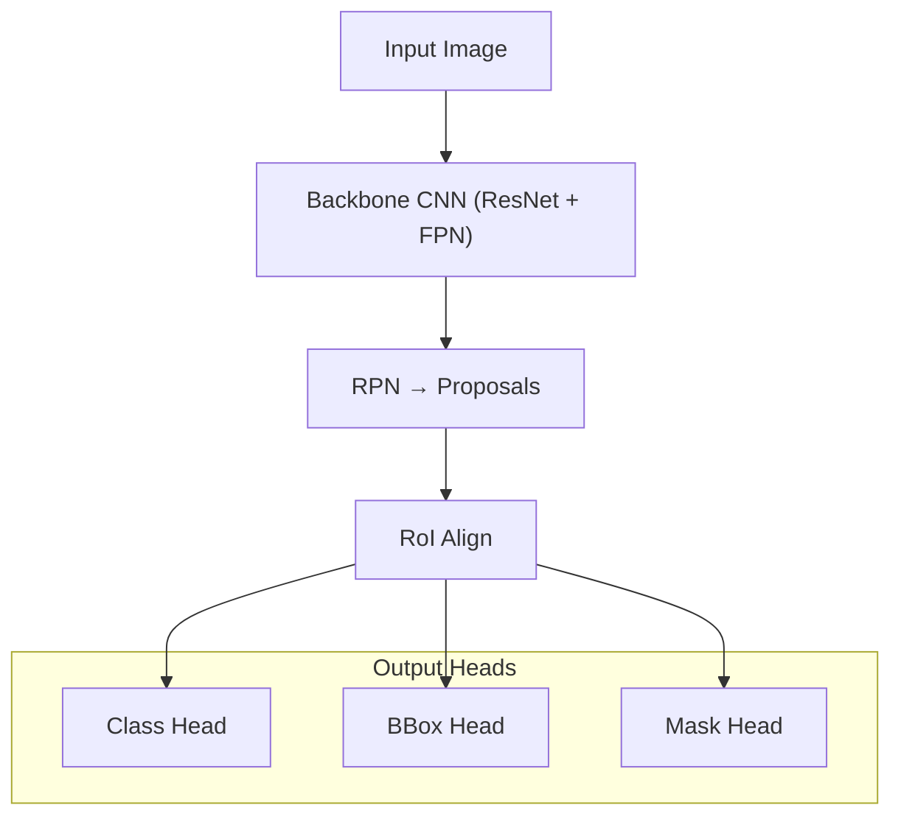

# 核心算法说明

单目深度估计算法
Mask RCNN的改进策略
PCA分析方法
具体讲解这几个核心算法的原理、细节、优化方式

## 一、单目深度估计算法

### （一）、算法简介

**Depth Anything** 是由香港大学、浙江大学与 TikTok 联合提出的 **单目深度估计（Monocular Depth Estimation, MDE）** 框架。它通过结合 **有标签数据学习 + 无标签数据伪监督 + 语义辅助学习**，实现了在多场景、多尺度下鲁棒且高效的单目深度预测。

> 原始论文：[Depth Anything: Unleashing the Power of Large-Scale Unlabeled Data](https://arxiv.org/abs/2403.09779)

### （二）、核心原理

Depth Anything 的核心思想为 **教师-学生框架**（Teacher-Student Paradigm），融合了：

1. **多数据集监督训练（Multi-dataset Supervised Training）**
2. **大规模无标签图像的伪标签学习（Pseudo-label Learning）**
3. **语义增强辅助任务（Semantics-Assisted Learning）**

### （三）、算法结构详解

#### 1. 教师模型训练阶段

- 使用六个公共深度数据集（如 NYU-Depth-v2、KITTI 等）共计约 **150 万张带标签图像**。
- 借鉴 MiDaS 的处理方式（深度归一化 + 仿射不变损失）进行联合训练。
- 采用 ResNet 或 Swin Transformer 作为 Backbone，输出中间语义特征。

#### 2. 无标签图像伪监督阶段

- 从网络、图像搜索引擎和公共任务中 **采集数百万张无标签图像**。
- 使用训练好的教师模型生成深度伪标签；
- 学生模型以带标签图像 + 伪标签图像联合训练，使用数据增强（颜色扭曲 + 空间扭曲）提高泛化能力。

#### 3. 语义辅助任务（SA）

- 对无标签图像添加语义分割伪标签；
- 引入 **DINOv2** 等语义强模型对齐语义特征；
- 在学生模型中加入辅助分支，引导深度分支学习更有意义的语义特征表示。

### （四）、损失函数设计

整体损失函数：

$$
\mathcal{L} = \lambda_{d} \cdot \mathcal{L}_{\text{depth}} + \lambda_{s} \cdot \mathcal{L}_{\text{semantic}} + \lambda_{a} \cdot \mathcal{L}_{\text{AffineInvariance}}$$

- $\mathcal{L}_{\text{depth}}$：尺度-不变深度损失；
- $\mathcal{L}_{\text{semantic}}$：辅助语义分割损失；
- $\mathcal{L}_{\text{AffineInvariance}}$：仿射不变损失（仿照 MiDaS）；
- 各损失项加权组合，用于学生网络训练。

### （五）、优化策略

#### 提升精度

- 引入更强的视觉基础模型（如 DINOv2）进行语义指导；
- 使用 MiDaS 风格的深度归一化和仿射不变损失增强鲁棒性；
- 跨多个公开深度数据集训练，提升泛化能力。

#### 提升效率

- 使用合成图像 + 大规模无标签图像，替代真实标注数据；
- 教师模型可以预计算伪标签，加快训练过程；
- 在推理阶段只保留学生模型，减少计算成本。

#### 模型规模多样性

- 官方发布多尺度模型（Tiny~Large），满足不同算力需求：
  - `depth_anything_tiny.pth`（25M 参数）
  - `depth_anything_base.pth`
  - `depth_anything_large.pth`（1.3B 参数）

## 二、Mask RCNN

### （一）、算法概述

**Mask R-CNN** 是一种用于目标检测和实例分割的深度学习模型，由 Facebook AI Research 于 2017 年提出。它在 Faster R-CNN 的基础上扩展了一个用于预测每个目标的分割掩码（Mask）分支，从而实现了更加精细的像素级识别。

- 目标检测：预测物体的类别和边界框（bounding box）
- 实例分割：为每个物体生成像素级别的掩码

> 原始论文：[Mask R-CNN (He et al., ICCV 2017)](https://arxiv.org/abs/1703.06870)

## （二）、网络结构详解

Mask R-CNN 的结构包含以下几个核心模块：

1. **Backbone 主干网络**（如 ResNet50-FPN）：提取图像特征；
2. **RPN（Region Proposal Network）**：生成可能含有目标的候选区域（Region Proposal）；
3. **RoI Align（Region of Interest Align）**：精确对齐每个候选区域的特征；
4. **Head 网络**（多任务分支）：
   - 分类分支：预测每个候选框的类别；
   - 回归分支：预测候选框的坐标；
   - 分割分支：为每个对象生成二值掩码。

### （三）网络流程图



## （四）、关键技术细节

### 1. Feature Pyramid Network（FPN）

- 用于多尺度特征提取，提高对小物体的识别能力；
- 将不同尺度的特征图融合，自底向上传播语义信息。

### 2. RoI Align（精度改进）

- 相比 RoI Pooling，避免了量化误差；
- 使用双线性插值对每个 RoI 进行精确采样。

### 3. 多任务损失函数

Mask R-CNN 的损失函数包含三个部分：

$$
L = L_{\text{cls}} + L_{\text{box}} + L_{\text{mask}}
$$

- $L_{\text{cls}}$：分类交叉熵损失；
- $L_{\text{box}}$：边界框回归损失（Smooth L1）；
- $L_{\text{mask}}$：每个类别的二分类像素掩码损失（BCE loss）。

## （五）、优化方式与改进方向

### 提高精度

- **使用更深的主干网络**：如 ResNet-101, ResNeXt；
- **融合注意力机制**：CBAM、SE-Block；
- **使用 Soft-NMS**：替代标准 NMS 减少目标漏检；
- **类别特定的掩码预测**：针对不同类别训练独立的掩码分支。

### 提高速度

- **简化 Backbone（如 MobileNet）**：用于边缘设备；
- **使用共享计算**：RoI Align 时共享基础特征图；
- **使用 TensorRT / ONNX 优化推理速度**。

### 增强泛化能力

- **多尺度训练与测试**
- **数据增强策略（翻转、缩放、色彩变换）**
- **使用更大规模的预训练模型（如 COCO、LVIS）**

## 三、PCA分析方法

### （一）背景简介

在点云处理中，获取点云的**主方向**对于物体姿态估计、对齐、建模等任务非常关键。主方向反映了点云在空间中的分布趋势，**PCA（Principal Component Analysis）** 是一种经典的无监督学习算法，可以有效提取数据的主方向信息。

在三维点云中，PCA 能够识别数据在三个主轴方向（X、Y、Z）上的最大方差方向，从而估算出点云的长轴、宽轴和厚轴等几何特性。

### （二）PCA 基本原理

PCA 是通过以下步骤实现数据主方向提取的：

1. **均值中心化**：对所有点进行中心化处理，使其均值为 0；
2. **协方差矩阵计算**：计算中心化后点集的协方差矩阵；
3. **特征值分解**：对协方差矩阵进行特征值分解，得到特征值和特征向量；
4. **排序并选择主轴**：根据特征值大小排序，对应的特征向量即为主方向。

### （三）算法流程

设点云数据集为 $P = \{p_1, p_2, ..., p_n\}$，其中每个 $p_i \in \mathbb{R}^3$ 是三维点。

#### 1. 计算均值点

$$
\bar{p} = \frac{1}{n} \sum_{i=1}^{n} p_i
$$

#### 2. 中心化点云

$$
P' = \{p'_i = p_i - \bar{p} \mid i = 1, 2, ..., n\}
$$

#### 3. 构建协方差矩阵

设 $X$ 为中心化后的 $n \times 3$ 矩阵（每行是一个 $p'_i$），则协方差矩阵为：

$$
C = \frac{1}{n} X^T X
$$

#### 4. 特征分解

对协方差矩阵 $C$ 进行特征值分解：

$$
C v_i = \lambda_i v_i \quad (i = 1, 2, 3)
$$

其中 $\lambda_i$ 是特征值，$v_i$ 是对应的特征向量。

#### 5. 结果解释

- 最大特征值对应的特征向量：**主方向（长轴）**
- 次大特征值对应的特征向量：**次主方向（宽轴）**
- 最小特征值对应的特征向量：**法向/厚轴**

### （四）项目中具体实现

```python
        # 通过PCA找到主要方向
        from sklearn.decomposition import PCA

        try:
            # 提取属于最大簇的点
            largest_cluster_points = points[labels == max_cluster_index]

            # 执行 PCA
            pca = PCA(n_components=3)
            pca.fit(largest_cluster_points)
```
