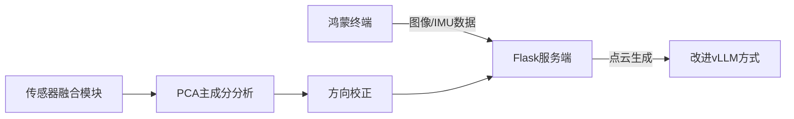
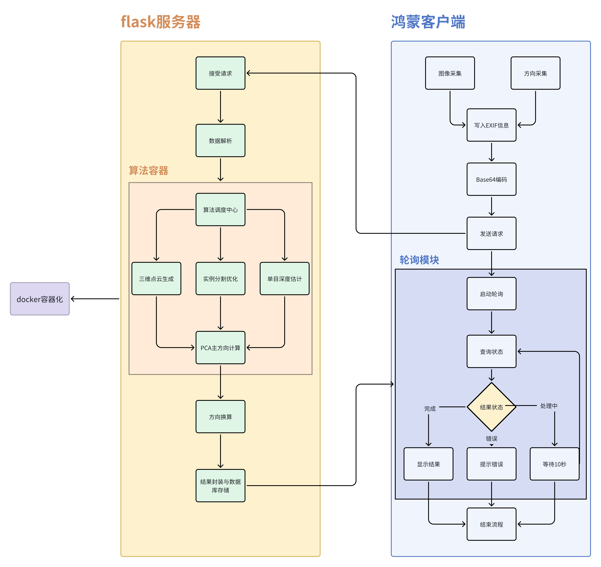

# 系统整体架构
## 一.系统设计思路
### 系统采用客户端-服务端架构进行功能验证：
  1. 客户端（鸿蒙系统）：实现图像采集、方向传感器数据获取、结果轮询等功能
  2. 服务端（Flask框架）：负责接收图像数据并执行核心算法处理
  3. 算法模块：
  - 通过单目深度估计与实例分割技术构建车辆三维点云
  - 改进原vLLM方法存在的时延高、稳定性不足问题
  - 结合终端方向传感器数据，应用PCA主成分分析计算车辆实际朝向
### 核心技术创新点：  
双流特征提取网络：并行处理RGB图像与深度图，通过跨模态注意力机制增强特征表达能力  

## 二.完整系统框架示意图
