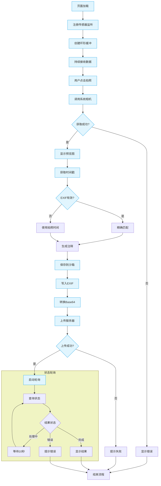

# 客户端设计说明
## 1. 总体概览
本客户端基于ArkTS（鸿蒙生态的应用开发语言）开发，主要功能流程是：
- 采集设备方向传感器数据
- 拍照并选择图片
- 读取图片，写入EXIF信息（用户备注）

- 将图片编码为Base64上传到服务器

- 轮询服务器查询处理结果

- 根据处理结果（如旋转角度）在前端更新展示

架构上主要划分为：

- 传感器数据采集模块

- 图片处理模块

- 网络通信模块

- UI模块

### 客户端流程图




## 2. 模块详细设计说明
### 2.1 传感器数据采集模块
主要功能：
- 监听设备方向传感器（Orientation）

- 将传感器数据以固定频率采样并缓存，供后续图片处理使用

核心代码如下：
```
aboutToAppear() { //页面打开时订阅传感器
    try {
      sensor.on(sensor.SensorType.SENSOR_TYPE_ID_ORIENTATION, (data: sensor.OrientationResponse) => {
        const timestamp = Date.now(); // 这是一个以毫秒为单位的时间戳
        this.sensorBuffer.push({ timestamp, data });
        if (this.sensorBuffer.length > this.BUFFER_SIZE) {
          this.sensorBuffer.shift();
        }
      }, { interval: this.sensorInterval });
    } catch (error) {
      console.error('传感器订阅失败:', error);
    }
}
aboutToDisappear() { //页面关闭时取消传感器订阅
     try {
      sensor.off(sensor.SensorType.SENSOR_TYPE_ID_ORIENTATION);
    } catch (error) {
      console.error('取消传感器订阅失败:', error);
    }
}
```
数据通过```@State sensorBuffer: SensorDataPoint[] = [];```数组保存最近的100个数据点。

### 2.2 图片处理模块
主要功能：
- 选取图片

- 写入EXIF信息

- 将图片转换成Base64编码

写入EXIF信息的关键代码如下：
```typescript
async writeUserComment(filePath: string, comment: string) { //写入EXIF信息
  const file = fs.openSync(filePath, fs.OpenMode.READ_WRITE);
  let imageSource = image.createImageSource(file.fd);
  await imageSource.modifyImageProperty(image.PropertyKey.USER_COMMENT, comment);
}
```
将图片转换成Base64编码的关键代码如下：
``` typescript
async JPG2Base64(filePath: string) { //图片转换成Base64编码
  const file = fs.openSync(filePath, fs.OpenMode.READ_WRITE);
  const imageSource = image.createImageSource(file.fd);
  const imagePackerApi = image.createImagePacker();
  const packOpts = { format: 'image/jpeg', quality: 100 };
  const data = await imagePackerApi.packToData(imageSource, packOpts);
  const base64Helper = new util.Base64Helper();
  const base64Str = base64Helper.encodeToStringSync(new Uint8Array(data));
}
```
EXIF写入采用ImageKit提供的方法，Base64编码后进行上传。

### 2.3 网络通信模块
主要功能：

- 上传图片

- 轮询查询图片处理状态

轮询查询状态核心代码如下：

```typescript

if (status !== 'processing' || attempts >= maxAttempts) {
        clearInterval(intervalId);
        const duration = Math.floor((new Date().getTime() - startTime) / 1000);
        console.error(`超时：轮询结束！状态: ${status}, 用时: ${duration}秒`);
        console.info(`总用时: ${Math.floor(duration / 60)}分${duration % 60}秒`);
        if (status === 'processing') {
          reject(new Error('轮询超时'));
        } else {
          resolve(null);
        }
        return;
      }

      attempts++;
```
轮询最多进行60次，查询旋转角度处理结果。

### 2.4 UI模块
UI设计概述：本客户端使用基于ArkTS的声明式开发范式的UI设计。使用Navigation作为页面的根容器，以list为布局的主要容器来管理子组件的布局和约束。
约束图片显示，保持宽高比进行缩小或者放大，使得图片两边都大于或等于显示边界。
主要实现功能：
- 拍照功能交互
- 展示图片
- 实时显示本地传感器数据
- 显示服务器回传信息

前端UI部分示例：
``` typescript
ListItem() {
  Image(this.imgSrc)
    .width(210)
    .height(280)
    .backgroundColor(Color.Black)
    .margin(5)
    .border({ width: 1 })
    .objectFit(ImageFit.Cover)
    .overlay('', { align: Alignment.Bottom, offset: { x: 0, y: 20 } });
}
```


## 3. 错误处理策略
实现功能：
- HTTP请求错误、服务器返回异常，均进行错误日志记录
- JSON解析异常时捕获并上报
- 超时轮询后提示“轮询超时”
- 上传失败、查询失败后及时更新前端提示


示例代码(ArkTS)
```typescript
.catch((e: BusinessError) => {
  this.reply="上传失败";
  console.error('上传失败', e);
})
```