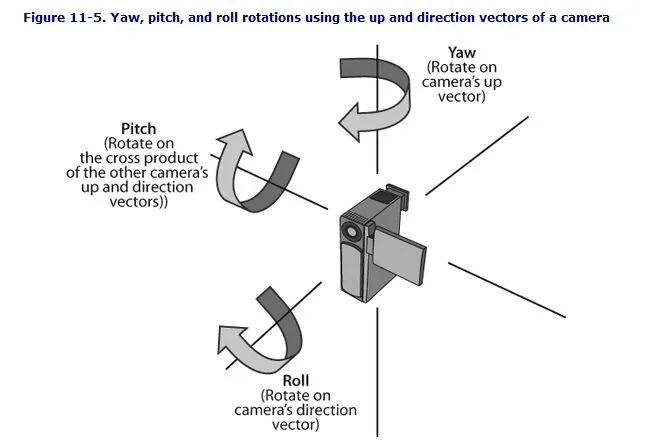
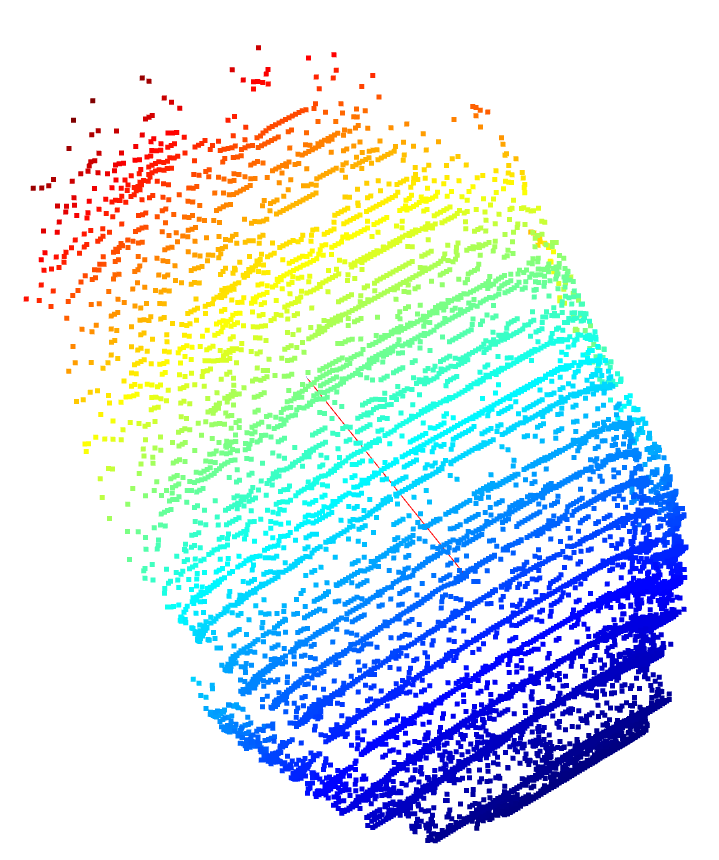

# 多模态数据融合与PCA分析

## 一、概述

- 本章节介绍了我们在数据处理流程中所使用的多模态数据融合与PCA分析方法，其中涵盖了图像的方向传感器数据（EXIF信息）与三维点云数据的集成与对齐。
- 首先从图像中提取包含姿态信息（偏航角Yaw、俯仰角Pitch、翻滚角Roll）的EXIF用户评论字段，并基于欧拉角构建旋转矩阵，描述相机在空间中的朝向。
- 接着，结合车辆图像的语义分割结果和深度估计模型生成的三维点云数据，提取出车身部分的空间结构信息。
- 最后，利用PCA（主成分分析）方法对车身点云进行分析，提取其主要空间方向，并通过旋转矩阵将其从相机坐标系转换到世界坐标系中。
这一数据融合过程使我们能够准确地获取车辆在世界坐标中的朝向信息，为后续的定位、建图或导航任务提供坚实的几何基础。

## 二、方向传感器数据

### （一）EXIF文件格式

**EXIF**（Exchangeable Image File Format）是专门为数码相机照片设定的一种文件格式，用于记录数码照片的属性信息和拍摄数据。EXIF信息可以附加于JPEG、TIFF、RIFF等文件中，为其增加有关数码相机拍摄信息的内容和索引图或图像处理软件的版本信息。EXIF信息包含了丰富的拍摄数据和图像属性，主要包括以下几类信息：

- 图像信息：如图像描述、来源、生产厂家、设备型号、**方向**、分辨率、软件版本等。
- 拍摄记录：如曝光时间、光圈值、曝光程序、ISO感光度、拍摄时间、数字化时间、色彩组合方案、压缩程度、曝光补偿、最大光圈、测光方式、光源、闪光灯使用情况、焦距等。
- 缩略图信息：如缩略图的宽度和高度。
- GPS信息：如拍摄时的经度、纬度、高度等

我们需要的方向信息保存在了UserComment字段，解析后可用于计算相机与车辆方向

```json
UserComment: ASCIIYaw:185.22156,Pitch:-31.785954957370578,Roll:4.045600990797533
```

解析后的 UserComment:

```json
{'Yaw': '185.22156', 'Pitch': '-31.785954957370578', 'Roll': '4.045600990797533'}
```

### （二）欧拉角Pitch、Roll、Yaw


#### 1. **理解三轴角度的含义**

- Yaw (偏航角): 绕 YY-轴旋转的角度。数值范围0~360。正北方为0，顺时针增加，1°对应yaw单位数值1(另外两个参数同样也是)

- Pitch (俯仰角): 绕 XX-轴旋转的角度。数值范围-90~+90。方向朝向水平时数值为0，朝向正上方时数值为+90，朝向正下方时数值为-90

- Roll (翻滚角): 绕 ZZ-轴旋转的角度。数值范围`-45°~+45°`。相机未朝正方旋转、横置或者倒置时数值为0，所以数值范围是`-45°~+45°`，顺时针（手持朝向）时为负，逆时针为正。

#### 2. **旋转矩阵的构造**

旋转矩阵的作用是通过旋转角度对向量进行变换。为了计算重力方向的变化，我们需要分别计算绕 Yaw、Pitch 和 Roll 旋转的矩阵：
(1)**绕 Y轴的旋转矩阵 (偏航角)**
偏航角表示相机相对于地面的水平方向旋转，绕 Y轴 旋转的矩阵如下：
$$R_y(\text{Yaw}) =
\begin{bmatrix}
\cos(\text{Yaw}) & 0 & \sin(\text{Yaw}) \\
0 & 1 & 0 \\
-\sin(\text{Yaw}) & 0 & \cos(\text{Yaw})
\end{bmatrix}$$
 这个矩阵使得水平方向上的向量在旋转时，能够绕 Y轴 旋转。
(2)**绕 X轴的旋转矩阵 (俯仰角)**
俯仰角表示相机上下旋转，绕 X轴 旋转的矩阵如下：
$$R_x(\text{Pitch}) =
\begin{bmatrix}
1 & 0 & 0 \\
0 & \cos(\text{Pitch}) & -\sin(\text{Pitch}) \\
0 & \sin(\text{Pitch}) & \cos(\text{Pitch})
\end{bmatrix}$$
这个矩阵使得垂直方向上的向量能够绕 X轴 旋转，表示上下俯仰。
(3)**绕 Z轴的旋转矩阵 (翻滚角)**
翻滚角表示相机沿着前后方向旋转，绕 Z轴 旋转的矩阵如下：
$$R_z(\text{Roll}) =
\begin{bmatrix}
\cos(\text{Roll}) & -\sin(\text{Roll}) & 0 \\
\sin(\text{Roll}) & \cos(\text{Roll}) & 0 \\
0 & 0 & 1
\end{bmatrix}$$
这个矩阵使得相机的旋转沿着其自身的 Z轴 发生翻滚。

#### 3. **总旋转矩阵**

为了将重力方向从世界坐标系变换到相机坐标系，我们需要将以上三个旋转矩阵相乘。旋转的顺序是先绕Z轴翻滚角旋转，然后绕 X轴俯仰角旋转，最后绕Y轴偏航角旋转。我们通过矩阵乘法组合这三次旋转。因此，最终的总旋转矩阵为：
$$R = R_z(\text{Roll}) \cdot R_x(\text{Pitch}) \cdot R_y(\text{Yaw})$$

### （三）EXIF数据传输
我们设计了一个DirectBody类用于提取EXIF信息、解析方向角、计算旋转矩阵和坐标系转换的功能

#### 1. 读取图像的 EXIF 信息
DirectedBody 类通过图像路径读取并解析 EXIF 信息，特别是从图像的 UserComment 字段中提取方向数据（yaw、pitch、roll）。

**方法：_read_exif**
该方法使用 PIL 库读取图像文件并提取 EXIF 数据。如果图像包含 EXIF 数据，方法会将标签 ID 转换为可读标签并返回字典形式的 EXIF 数据。

```python
def _read_exif(self):
    # 打开图像文件并提取 EXIF 数据
    image = Image.open(self.image_path)
    exif_data = image._getexif()
    if exif_data:
        exif = {}
        for tag_id, value in exif_data.items():
            tag = TAGS.get(tag_id, tag_id)
            exif[tag] = value
        return exif
    else:
        print("该图片没有 EXIF 信息。")
        return None
```
#### 2. 解析方向角
DirectedBody 类从图像的 EXIF 数据中解析出方向角（yaw、pitch、roll）。这些数据通常存储在 UserComment 字段中，并以键值对形式存储。

**方法：_parse_orientation**
该方法解析 UserComment 字段中的数据，提取出 yaw（偏航角）、pitch（俯仰角）和 roll（翻滚角）。这些角度以度为单位返回。

```python
def _parse_orientation(self):
    user_comment = self.exif_data.get("UserComment")
    if not user_comment:
        raise ValueError("UserComment 字段不存在或为空。")
    comment = user_comment.split["\x00"](-1)  # 处理编码前缀
    parsed = {}
    for part in comment.split(","):
        key, value = part.split(":")
        parsed[key.strip()] = value.strip()
    return parsed
```

#### 3. 计算旋转矩阵
通过 yaw、pitch 和 roll 角度，DirectedBody 类计算旋转矩阵，用于将相机坐标系和参考坐标系之间的转换。

**方法：_compute_rotation_matrix**
该方法将偏航角（yaw）、俯仰角（pitch）和翻滚角（roll）转换为弧度，然后分别计算绕 Y、X 和 Z 轴的旋转矩阵。最后，所有旋转矩阵相乘得到总的旋转矩阵。

```python
def _compute_rotation_matrix(self):
    yaw_rad = np.radians(self.yaw)
    pitch_rad = np.radians(self.pitch)
    roll_rad = np.radians(self.roll)

    # 绕 Y 轴的旋转矩阵（偏航）
    R_y = np.array([
        [np.cos(yaw_rad), 0, np.sin(yaw_rad)],
        [0, 1, 0],
        [-np.sin(yaw_rad), 0, np.cos(yaw_rad)],
    ])
    # 绕 X 轴的旋转矩阵（俯仰）
    R_x = np.array([
        [1, 0, 0],
        [0, np.cos(pitch_rad), -np.sin(pitch_rad)],
        [0, np.sin(pitch_rad), np.cos(pitch_rad)],
    ])
    # 绕 Z 轴的旋转矩阵（翻滚）
    R_z = np.array([
        [np.cos(roll_rad), -np.sin(roll_rad), 0],
        [np.sin(roll_rad), np.cos(roll_rad), 0],
        [0, 0, 1],
    ])

    # 计算总的旋转矩阵
    out = R_z @ R_x @ R_y
    return out
```
#### 4. 坐标转换
DirectedBody 类提供将坐标从世界坐标系转换为相机坐标系，或者从相机坐标系转换回世界坐标系的方法。这通过旋转矩阵的乘法实现。

**方法：world_to_camera_coordinates**
将世界坐标系的属性转换为相机坐标系。
```python
def world_to_camera_coordinates(self, attr_name):
    attr_value = getattr(self, attr_name, None)
    if attr_value is not None and getattr(self, f"{attr_name}_CoordinateSystem_iscamera", False) == False:
        setattr(self, attr_name, self.rotation_matrix_inv @ attr_value)
        setattr(self, f"{attr_name}_CoordinateSystem_iscamera", True)
```

**方法：camera_to_world_coordinates**
将相机坐标系的属性转换为世界坐标系。

```python
def camera_to_world_coordinates(self, attr_name):
    attr_value = getattr(self, attr_name, None)
    if attr_value is not None and getattr(self, f"{attr_name}_CoordinateSystem_iscamera", False) == True:
        setattr(self, attr_name, self.rotation_matrix @ attr_value)
        setattr(self, f"{attr_name}_CoordinateSystem_iscamera", False)
```
## 三、PCA分析

### 1. 获取电动车车身掩膜

首先，获取电动车的车身掩膜，并对掩膜数据进行二值化处理：
- 车身区域被标记为前景区域，数据值为 1；
- 其他区域数据值为 0。
```python
    #解码掩膜数据
    byte_data = base64.b64decode(mask)
    flat_mask = np.unpackbits(np.frombuffer(byte_data, dtype=np.uint8))
    mask_shape = response.json().get["masks", []](0).get("mask_rle", {}).get("size", "")
    total_pixels = mask_shape[0] * mask_shape[1]
    flat_mask = flat_mask[:total_pixels]
    decoded_mask = flat_mask.reshape(mask_shape, order='F')
    print(f"解码掩膜数据成功,掩膜形状: {decoded_mask.shape}")#掩膜形状: (1205, 720)

    # 扩展掩膜维度
    decoded_mask_rgb = np.stack([decoded_mask]*3, axis=-1)  # (H, W) -> (H, W, 3)

# 应用掩膜，提取图像中车辆区域
    bike_mask_rgb = raw_image * decoded_mask_rgb  # 逐像素乘法

# 转为灰度图
    bike_mask_gray = cv2.cvtColor(bike_mask_rgb, cv2.COLOR_BGR2GRAY)

# 二值化处理
    _, bike_mask_binary = cv2.threshold(bike_mask_gray, 200, 255, cv2.THRESH_BINARY)

# 背景反色（前景为0，背景为255）
    bike_mask_inverted = 255 - bike_mask_binary
    print (f"掩膜反转成功,掩膜形状: {bike_mask_inverted.shape}")#掩膜形状: (1205, 720)

# 保存掩膜结果
    cv2.imwrite(os.path.join(output_path, "bike_mask.jpg"), bike_mask_inverted)
```

### 2. 提取车身区域

根据掩膜数据，提取原始图像中对应车身的部分，将其从原图中单独提取出来。这一步可以帮助我们集中处理车身相关信息。

### 3. 获取车身深度图

使用 **Deepth-Anything** 模型获取车身区域的深度图。该深度图包含了每个点的深度信息，帮助我们理解车身的空间结构。

### 4. 生成点云

基于深度图数据，生成车身的 **点云**。点云由大量的三维坐标点组成，表示物体在空间中的分布。通过这一数据，我们能够更好地分析车身的形状和结构。
### 5. 点云降噪
- 去除点云中的孤立点或噪声点。
- 解决的问题：避免噪声干扰后续的聚类和特征计算。
### 6. PCA分析

使用 **PCA（主成分分析）** 算法对点云数据进行分析，找到点云的主要方向。

```python
        # 通过PCA找到主要方向
        from sklearn.decomposition import PCA

        try:
            # 提取属于最大簇的点
            largest_cluster_points = points[labels == max_cluster_index]

            # 执行 PCA
            pca = PCA(n_components=3)
            pca.fit(largest_cluster_points)
```

## 四、数据融合流程
在PCA分析中得到了车身点云的主要方向向量，这个方向向量基于相机坐标系，我们可以利用EXIF中的旋转角信息，通过旋转矩阵将这个向量转换到世界坐标系中，计算转换后向量在地面上投影与参考物的夹角即可得判断车辆是否停放标准
```python
    def compute_projection_angle(self, vector):
        """计算车座方向在水平面 (XOZ) 上的与参考物方向的投影夹角"""
        print(f"原始向量: {vector}")
        vector= np.linalg.inv(self.rotation_matrix) @ vector# 转换到世界坐标系中
        print(f"转换后的向量: {vector}")
        v1_proj = np.array([-vector[2],0, vector[0]])  # 投影
        v1_proj = v1_proj / np.linalg.norm(v1_proj)# 单位化
        print(f"投影: {v1_proj}")
        angle = np.arccos(np.dot(v1_proj, [1, 0, 0]) / (np.linalg.norm(v1_proj) * np.linalg.norm([-1, 0, 0])))
        print(f"夹角: {np.degrees(angle)}")
        return np.degrees(angle)
```
