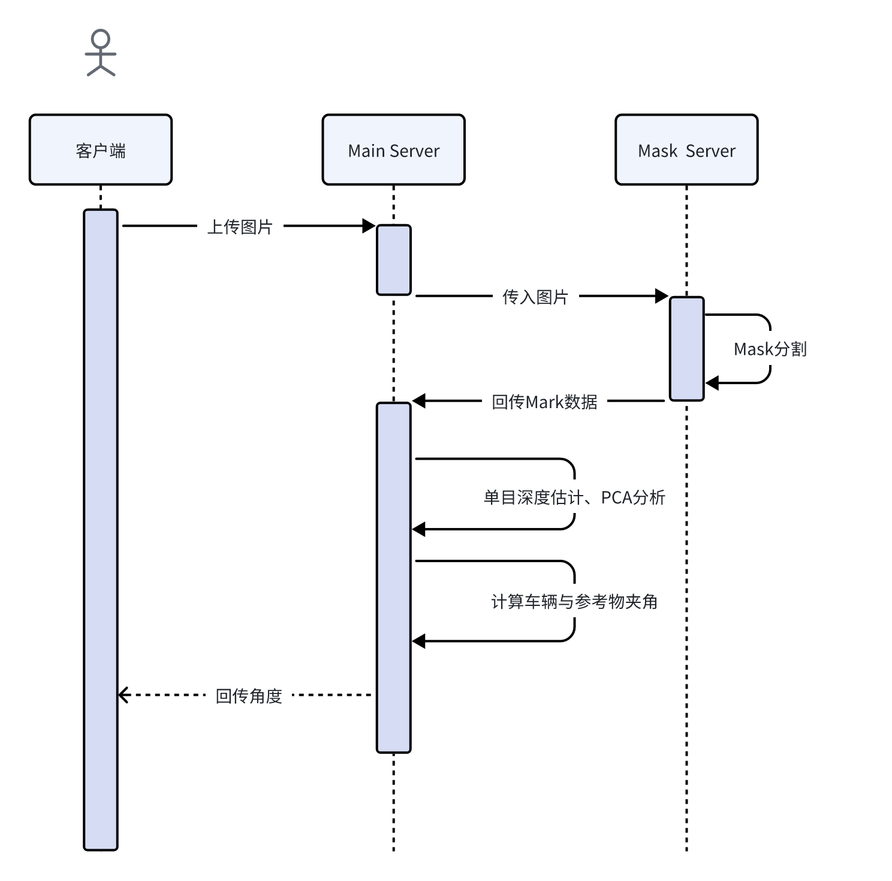

# Flask服务端设计

## 一、概述
本项目采用Flask框架进行docker之间的通信与接口调用，主要实现了图像上传、图像处理、状态查询等功能。整个服务由多个接口组成，支持图像上传、处理结果查询以及图像处理状态的管理。以下是整体交互流程图：


## 二、Mask Server

### （一）基本信息
- **基础URL**: http://服务器IP:5000
- **内容类型**: application/json 或 multipart/form-data

###  （二）接口列表

#### 1. 健康检查接口
- **请求方式**: `GET`
- **路径**: `/health`
- **描述**: 用于检查服务是否正常运行
- **响应示例**:
    ```json
    {
      "status": "ok"
    }
    ```

#### 2. 图像掩膜预测接口
- **请求方式**: `POST`
- **路径**: `/predict`
- **描述**: 接收图片，使用`Mask R-CNN`模型进行实例分割，返回分割掩膜信息

##### （1）请求格式：
支持两种提交方式：
1. 表单提交 (multipart/form-data):
- **参数名**: file
- **参数类型**: 图片文件
- **请求体格式**:
```json
{
  "file": "二进制编码的图片数据"
}
```

- **示例代码 (Python)**:
```python
import requests

url = "http://服务器IP:5000/predict"
files = {"file": open("path/to/image.jpg", "rb")}
response = requests.post(url, files=files)
print(response.json())
```

2. JSON提交 (application/json):
- **参数名**: image
- **参数类型**: Base64编码的图片数据
- **请求体格式**:
```json
{
  "image": "Base64编码的图片数据"
}
```
- **示例代码 (Python)**:
```python
import requests
import base64

url = "http://服务器IP:5000/predict"
with open("path/to/image.jpg", "rb") as image_file:
    encoded_string = base64.b64encode(image_file.read()).decode('utf-8')

payload = {"image": encoded_string}
headers = {"Content-Type": "application/json"}
response = requests.post(url, json=payload, headers=headers)
print(response.json())
```

##### （2）响应格式:
- 成功响应
```python
{
  "status": "success",
  "count": 2,  // 检测到的对象数量
  "masks": [
    {
      "mask_id": 0,
      "mask_rle": {
        "counts": "Base64编码的RLE压缩掩膜数据",
        "size": [高度, 宽度]  // 掩膜尺寸
      }
    },
    {
      "mask_id": 1,
      "mask_rle": {
        "counts": "Base64编码的RLE压缩掩膜数据",
        "size": [高度, 宽度]  // 掩膜尺寸
      }
    }
  ]
}
```
- 响应失败
```python
{
  "error": "错误描述信息"
}
```

## 三、Main Server

### （一）基本信息

- **基础URL**: http://服务器IP:11470
- **内容类型**: application/json
- **文件上传目录**: `uploads`
- **数据库**: SQLite（存储图像处理记录）

### （二）接口列表

#### 1. 上传图像接口
- **请求方式**: POST
- **路径**: `/upload`
- **描述**: 用于上传图像，并启动后台异步处理任务
- **请求格式**: JSON
```json
   {"image": "Base64编码的图像数据"}
```
- **响应示例**:
  ```json
  {
    "message": "success upload image",
    "filename": "image.jpg"
  }
  ```
  
- **说明**:

    -  将Base64编码的图像数据传递到image字段中

    - 后端将异步处理图像并保存到本地uploads目录

    - 初始处理状态为processing，处理结果会更新为completed或error，并存储在SQLite数据库中。

 #### 2. 查询处理状态接口
- **请求方式**: GET

- **路径**: /status/<filename>

- **描述**: 查询指定图像的处理状态

- **请求格式**: URL参数 `<filename>`: 图像文件名（例如 image.jpg）
- **响应示例**:
```json
{
  "status": "completed",
  "filename": "image_20230515_123456.jpg",
  "degree": 0.95
}
```
**status**: 图像处理状态，processing（处理中）、completed（已完成）、error（出错）

**degree**: 处理完成后的度数（当status为completed时返回）

- **错误响应示例**:
```json
{
  "error": "找不到该文件的处理记录"
}
```

### （三）处理步骤设计

#### 初始化数据库
服务启动时，会初始化一个SQLite数据库（`image_process.db`），并在其中创建一个`image_results`表，用于存储图像的处理状态和度数信息。表结构如下：

```sql
CREATE TABLE IF NOT EXISTS image_results
(
    filename TEXT PRIMARY KEY, 
    status TEXT,
    degree REAL,
    created_at TIMESTAMP DEFAULT CURRENT_TIMESTAMP
)
```

#### 上传图像
用户通过/upload接口上传图像时，图像数据会被解码并保存为JPEG文件。然后，上传信息（包括图像文件名和处理状态）将被存入数据库。处理图像的任务会在后台异步执行。

#### 异步处理图像
上传图像后，后台会异步执行以下任务：

- 通过prase_image函数处理图像并保存到输出目录

- 使用prase_pca函数分析处理后的图像，返回一个度数值

- 更新数据库中的状态为completed，并存储分析的degree值。如果发生错误，则更新状态为error。