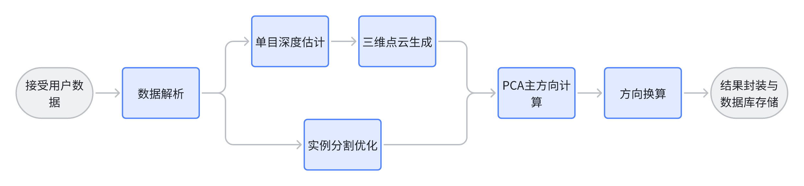

# 端到端推理流程说明

本文档主要介绍获取共享电动车的方向信息的端到端推理流程。

## 算法框架概述

1. 服务器首先接受用户上传的数据，解析方位角信息

2. 服务器从两个环节对数据进行处理：

- 单目深度估计与三维度重建

基于depth_anything_v2模型，进行单目深度估计，生成用户上传图片的深度图，获取共享电单车的三维坐标信息。然后使用open3d库进行三维重建，生成图片的三维点云模型。

- 实例分割优化

为了能够准确分析共享单车道朝向，需要对共享电单车进行分割。我们基于城市共享电单车数据集训练了专用的Mask R-CNN深度学习网络，用于提取用户上传图片的实例分割掩膜。

3. PCA主方向计算

基于图片的三维点云模型和共享电单车的实例分割掩膜，我们可以得到共享电单车的点云模型。然后使用PCA算法计算主方向，并将其作为共享电单车的朝向信息。

4. 方向换算

5. 封装与存储结果
