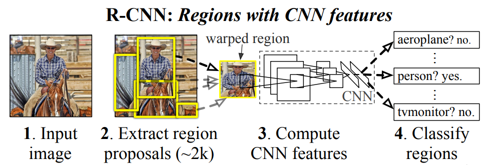
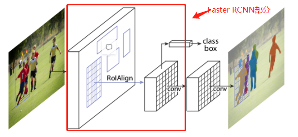

# 为何使用MASK_RCNN替代vLLM完成实例分割任务

1. 应用领域不同：Mask R-CNN 是一种专用于目标检测和实例分割的两阶段目标检测算法。vLLM（Very Large Language Model）则是一种语言模型，主要用于自然语言处理任务，例如文本生成、问答系统、机器翻译等。
2. 能力不同：Mask R-CNN通过引入分割分支来对每个候选区域进行像素级别的分类，从而实现高质量的实例分割结果，而vLLM只能完成目标检测的任务。
3. 速度不同：Mask R-CNN的训练与推理速度比vLLM更快。
4. 算力要求不同：Mask R-CNN的计算量比vLLM更小，可以在单个GPU上进行实时推理。

# MASK_RCNN的具体实现

## 基于R-CNN网络

R-CNN（Regions with CNN features）是目标检测领域的一个重要里程碑，由 Ross Girshick 等人在2014年提出。它首次将深度学习的强大特征提取能力应用于目标检测任务，并取得了显著的性能提升。

R-CNN 方法在处理图像时，首先生成一系列可能包含对象的区域（候选区域），然后对每个区域独立地使用卷积神经网络（CNN）提取特征，最后使用支持向量机（SVM）进行分类，并通过回归器调整边界框的位置。

## Fast R-CNN：提高效率与准确性

Fast R-CNN 基于R-CNN进行了以下优化。

- 共享计算：与原始 R-CNN 不同，Fast R-CNN 首先在整个图像上运行卷积操作以提取特征图，而不是为每个候选区域单独提取特征。这大大减少了冗余计算。
- ROI 池化层：引入了感兴趣区域（Region of Interest, ROI）池化层，该层将不同大小的候选区域映射到固定大小的特征向量，以便后续全连接层能够处理。
- 多任务损失：Fast R-CNN 同时训练分类器和边界框回归器，使得整个模型可以通过单一的前向传播过程同时完成目标分类和定位。

Faster R-CNN 在 Fast R-CNN 的基础上通过以下改进进一步提升了效率和性能。

- 区域提议网络（Region Proposal Network, RPN）：这是 Faster R-CNN 最重要的创新点。与之前的 R-CNN 和 Fast R-CNN 使用选择性搜索等外部工具来生成候选区域不同，Faster R-CNN 引入了一个深度卷积网络（即 RPN），该网络可以与用于分类和回归的网络共享卷积特征层。这意味着候选区域的生成现在也可以通过学习得到，并且可以直接利用已经计算好的特征图，极大地提高了效率。
- 共享卷积特征：Faster R-CNN 通过让 RPN 和后续的目标分类、边界框回归任务共享卷积层的输出，进一步减少了冗余计算。这种设计不仅加速了整个流程，也使得模型对输入图像的空间信息有了更好的理解。

## 引入分割分支,实现Mask R-CNN

Mask R-CNN 是在 Fast R-CNN 和 Faster R-CNN 基础上的进一步发展。

Faster R-CNN 引入了一个区域提议网络（Region Proposal Network, RPN），它允许模型自己学习如何提出候选区域，从而替代了外部的选择性搜索方法。在此基础上，Mask R-CNN 添加了一个用于预测每个实例掩膜的分支，因此除了进行分类和边界框回归之外，还能实现像素级别的分割，即实例分割。

- 实例分割：Mask R-CNN 在原有的分类和回归分支的基础上增加了一个并行的掩膜预测分支，用于输出每个目标实例的二值掩膜。
- RoIAlign 层：为了改善 ROI 池化层在处理不同尺度和旋转不变性的局限性，Mask R-CNN 使用了 RoIAlign 层。它更精确地保留了空间信息，对于生成高质量的掩膜至关重要。
