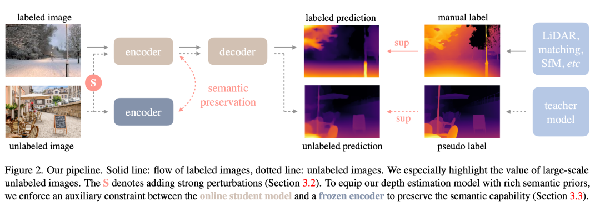
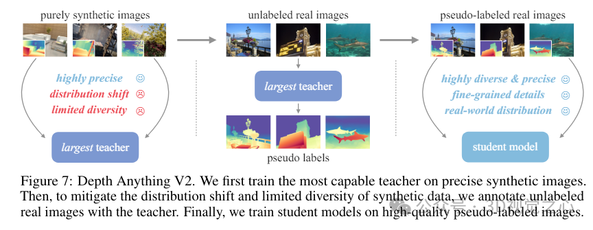

# 单目深度估计实现

## 单目深度估计

单目深度估计（Monocular Depth Estimation, MDE）是一项在计算机视觉领域中非常重要的技术，它旨在从单张图像中恢复出场景的三维结构。这项技术对于机器人导航、自动驾驶汽车、增强现实（AR）和虚拟现实（VR）等应用至关重要。

本模块基于DepthAnything V2实现单目深度估计

## DepthAnything

"DepthAnything"是TikTok、香港大学和浙江大学共同研发的一种先进单目深度估计技术。这项技术能够从2D图像中提取深度信息，并将其转换为3D影像。与传统的MDE技术相比，"DepthAnything"在提高深度图质量方面取得了显著进步，这使得它能够更准确地估计场景的深度信息。

“Depth Anything”利用带标签和未标记图像进行单目深度估计（MDE）。具体步骤如下：

学习带标签图像（Learning from Labeled Images）：此步骤中，采用类似于MiDaS的深度值变换与归一化技术，并使用仿射不变损失函数对来自六个公开数据集的150万张带标签图像进行多数据集联合训练，从而建立了一个导师模型T。

解锁未标记图像的潜力（Unlocking the Potential of Unlabeled Images）：与传统策略不同，这一方法重视通过大规模未标记图像来增强数据覆盖范围。通过从互联网和各种任务的公开数据集中收集，构建了一个既多样又大规模的未标记图像集合。使用导师模型T为这些未标记图像生成伪标签，并结合带标签图像和伪标签图像共同训练一个学生模型S。在训练过程中，应用强烈色彩和空间扭曲以促使学生模型积极探寻更多的视觉信息。

语义辅助感知（Semantics-Assisted Perception）：为了改进处理深度估计任务的能力，此方法引入了辅助语义分割任务，通过对未标记图像添加语义分割标签，提供高层次的语义信息。特别地，鉴于DINOv2模型在语义相关任务中的出色表现，本方法通过辅助特征对齐损失，将DINOv2模型的强大语义理解能力迁移到深度估计模型中。

## Depth Anything V2

Depth Anything V2是一种用于单目深度估计（Monocular Depth Estimation, MDE）的先进方法，代表了在Depth Anything基础上的重大升级。他实现了以下的创新与提升：

- 提升的细节处理：V2版本在深度预测的细节上进行了优化，能够提供更加精确和细致的深度图，从而提高了对场景理解的准确性。

- 更高的效率与准确性：相比之前的版本或基于其他技术（如Stable Diffusion）的方法，Depth Anything V2展示了显著提高的效率和准确性。它能够在保持甚至提升精度的同时大幅减少计算时间，据称比基于SD的模型快了10倍以上。
多规模模型支持：为了适应不同的应用场景和需求，研究人员提供了参数量从25M到1.3B不等的多种规模的模型，使得用户可以根据自己的需要选择最适合的模型配置。

- 改进的训练策略：
使用合成图像代替标记的真实图像进行训练，以提高训练效率。
增加教师模型的容量，以便更好地捕捉数据中的复杂模式，并增强模型的泛化能力。
利用大规模伪标签真实图像作为桥梁，帮助学生模型学习，从而提升模型在未见过的数据上的表现力。
新的评估基准：为了解决现有测试集存在的多样性和噪声问题，研究团队构建了一个新的评估基准，该基准具有更精确的注释和更多样化的场景，有助于更准确地评估模型性能。
动和模型驱动相结合：通过结合数据驱动（例如使用大量伪标注的真实图像）和模型驱动（如扩大教师模型的容量）的方法，解决了合成图像带来的泛化挑战，进一步提升了模型的鲁棒性和适用性。

## 本项目的应用

基于Depth Anything V2的单目深度估计，我们还原出用户拍摄的电单车图片的三维场景，并与实例分割模型协同，实现目标电单车的三维重建。
