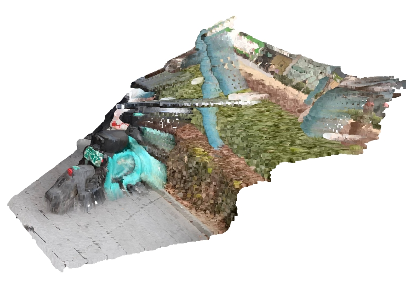

# 点云构建逻辑

## 获取深度图片

通过在服务器上部署depthanything_v2，对用户上传图片进行单目深度话估计，获取图片的深度图

## 构建点云

本项目基于Open3d库进行点云构建。

Open3D 是一个开源的、跨平台的 3D 数据处理与可视化库 ，广泛用于 点云处理、三维重建、几何分析、SLAM（同步定位与建图）、机器人视觉、计算机视觉 等领域。

Open3D 使用 相机内参模型 （Intrinsic Camera Model） 和 深度图 （Depth Image），将每个像素转换为世界坐标系中的三维点。这个过程称为 深度图转点云（Depth to Point Cloud） 。

### 1. **相机坐标系下的点计算**

对于每一个图像像素 $ (u, v) $，其在深度图中对应的深度值为 $ d $，我们可以根据以下公式将其转换为相机坐标系下的三维点 $ (x_c, y_c, z_c) $。

> 公式如下：
$$
\begin{aligned}
z_c &= d \\
x_c &= \frac{(u - c_x) \cdot d}{f_x} \\
y_c &= \frac{(v - c_y) \cdot d}{f_y}
\end{aligned}
$$

其中：

- $ (u, v) $：图像平面中的像素坐标；
- $ d $：该点的深度值（单位一般为米或毫米）；
- $ f_x, f_y $：相机焦距（单位为像素）；
- $ c_x, c_y $：主点坐标（即图像中心，通常为图像宽高的一半）；
- $ (x_c, y_c, z_c) $：相机坐标系下的三维坐标。

这个公式实际上就是标准的 **针孔相机模型（Pinhole Camera Model）**。

### 2. **把点云转换到世界坐标系（可选）**

如果你有外部变换矩阵 $ T_{world \to camera} $（即相机位姿），你可以进一步将点从相机坐标系变换到世界坐标系：

$$
P_{world} = T_{world \to camera}^{-1} \cdot P_{camera}
$$

这一步在 SLAM、RGB-D 相机、视觉定位等场景中非常常见，但在简单情况下可以忽略（即假设相机位于原点）。

最终，我们将用户拍摄的图片转换为点云，下图为他的可视化。

