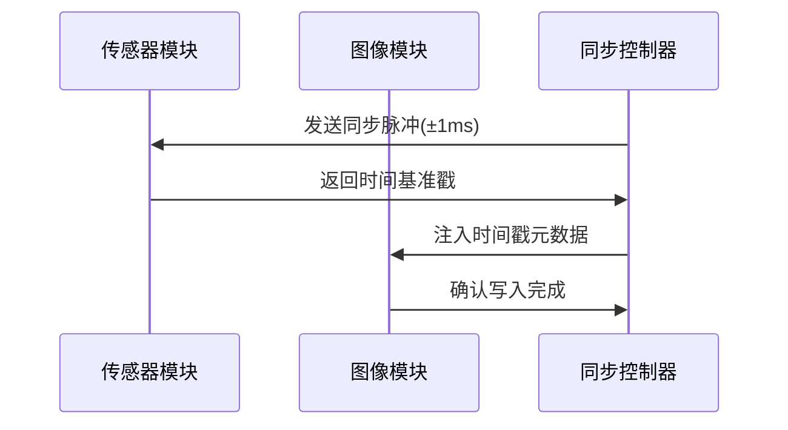

# 自建数据集说明

##  端到端测试数据集概述

本数据集通过移动端采集设备（智能手机）拍摄现实场景照片，同时记录拍摄时的设备方向传感器参数。所有传感器数据将写入对应照片的EXIF元数据中，用于后续计算机视觉任务（如图像方向校正、空间位置分析等）。

**数据采集流程**

### 时间同步机制

```mermaid
sequenceDiagram
    participant 传感器模块
    participant 图像模块
    participant 同步控制器
    
    同步控制器->>传感器模块: 发送同步脉冲(±1ms)
    传感器模块->>同步控制器: 返回时间基准戳
    同步控制器->>图像模块: 注入时间戳元数据
    图像模块->>同步控制器: 确认写入完成
```

